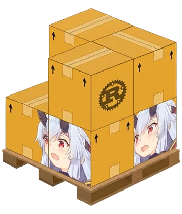

# tomoe

Robust doujinshi downloader, uncompromising in efficiency.

<a href="https://crates.io/crates/tomoe"></a>

- [tomoe](#tomoe)
  - [Features](#features)
  - [Supported Platform](#supported-platform)
  - [Prerequisites](#prerequisites)
  - [Installation](#installation)
    - [Install from Crates.io](#install-from-cratesio)
    - [Install from Source](#install-from-source)
    - [Run directly with Cargo](#run-directly-with-cargo)
  - [Usage Examples](#usage-examples)
    - [Single Gallery Download](#single-gallery-download)
    - [Download & Compile to PDF](#download--compile-to-pdf)
    - [Bulk Download from JSON](#bulk-download-from-json)
    - [CLI Options Reference](#cli-options-reference)
  - [Running Tests](#running-tests)
  - [Diagnostics & Logging](#diagnostics--logging)
  - [Pronunciation](#pronunciation)
  - [Legal](#legal)

---

## tomoe

> [!IMPORTANT]  
> Following this transition, the legacy Python-based version previously hosted on PyPI ([`pypi.org/project/tomoe`](https://pypi.org/project/tomoe/)) is deprecated and no longer maintained. All future updates, bug fixes, and feature additions will be distributed exclusively via the Rust version on Crates.io ([`crates.io/crates/tomoe`](https://crates.io/crates/tomoe)).

## Features

- **Automated Container Self-Hosting**
  Integrates seamlessly with the host's **Podman CLI** to auto-pull, configure, and launch the `ghcr.io/sinkaroid/jandapress:latest` scraper container on port `2002` only when required. No manual backend configuration is needed.

- **Highly Concurrent Download Engine**
  Built on top of a multi-threaded `tokio` runtime and `reqwest` connection pooling. Orchestrates asynchronous tasks with active `Semaphore` rate limiting to achieve maximum network efficiency without triggering scraper IP blocks.

- **Built-in PDF Compilation (Pure Rust)**
  Powered by the `printpdf` library. Automatically parses image formats, resolves physical dimensions, scales pages proportionally to fit standard A4 borders, and compiles them directly into high-quality PDFs.

- **Modular Bulk Processing**
  Resolves compound downloads through structured JSON bulk lists. Sequentially schedules and processes mixed targets from different online doujinshi boards in a single continuous pipeline execution.

- **Standardized Logger & Diagnostics**
  Standardized ISO 8601 UTC timestamps alongside real-time progress indicators for downloads and page rendering.

---

## Supported Platform

Resolve items directly from the following supported scraper sources:

| Provider                                         | CLI Flag        | Example ID / Chapter Path                                 |
| ------------------------------------------------ | --------------- | --------------------------------------------------------- |
| [`nhentai.net`](https://nhentai.net)             | `--nhentai`     | `255369`                                                  |
| [`pururin.to`](https://pururin.to)               | `--pururin`     | `47226`                                                   |
| [`hentaifox.com`](https://hentaifox.com)         | `--hentaifox`   | `59026`                                                   |
| [`hentai2read.com`](https://hentai2read.com)     | `--hentai2read` | `chaldea_life/1`                                          |
| [`asmhentai.com`](https://asmhentai.com)         | `--asmhentai`   | `311851`                                                  |
| [`3hentai.net`](https://3hentai.net)             | `--3hentai`     | `608979`                                                  |
| [`simply-hentai.com`](https://simply-hentai.com) | `--simply`      | `fate-grand-order/fgo-no-ashibon-fgo-foot-book/all-pages` |

---

## Prerequisites

- **Rust Toolchain**: Rust 1.75+ is required.
- **Podman CLI**: Required to host the local scraping container. (Skip container checks entirely using the `--no_selfhost` flag if query redirection is handled by a remote API you deploy [`jandapress`](https://ghcr.io/sinkaroid/jandapress:latest) by yourself).

---

## Installation

### Install from Crates.io

Simply install `tomoe` directly using Cargo:

```bash
cargo install tomoe
```

### Install from Source

Clone the repository and compile the source code:

```bash
git clone https://github.com/sinkaroid/tomoe.git
cd tomoe
cargo install --path .
```

### Run directly with Cargo

You can run `tomoe` directly inside the source tree without installing it to PATH:

```bash
cargo run -- --nhentai 255369
```

---

## Usage Examples

### Single Gallery Download

Fetch a book from nhentai and save all pages inside a flat folder name:

```bash
tomoe --nhentai 255369
```

### Download & Compile to PDF

Download all pages and compile them into a print-ready PDF centered with page margins:

```bash
tomoe --nhentai 255369 --pdf
```

### Bulk Download from JSON

Compile a list of multiple books across different providers in a JSON file (e.g. `legacy/doujin.json`) and run them:

```bash
tomoe --bulk legacy/doujin.json
```

**JSON Schema Example (`doujin.json`):**

```json
{
  "book": [
    { "nhentai": 255369 },
    { "pururin": 47226 },
    {
      "simply-hentai": "fate-grand-order/fgo-no-ashibon-fgo-foot-book/all-pages"
    }
  ]
}
```

---

## CLI Options Reference

| Argument                  | Description                                  | Example                                                                    |
| ------------------------- | -------------------------------------------- | -------------------------------------------------------------------------- |
| `--nhentai <ID...>`       | Download from nhentai                        | `tomoe --nhentai 255369`                                                   |
| `--pururin <ID...>`       | Download from pururin                        | `tomoe --pururin 47226`                                                    |
| `--hentaifox <ID...>`     | Download from hentaifox                      | `tomoe --hentaifox 59026`                                                  |
| `--hentai2read <PATH...>` | Download from hentai2read                    | `tomoe --hentai2read chaldea_life/1`                                       |
| `--simply <CHAPTER...>`   | Download from simply-hentai                  | `tomoe --simply "fate-grand-order/fgo-no-ashibon-fgo-foot-book/all-pages"` |
| `--asmhentai <ID...>`     | Download from asmhentai                      | `tomoe --asmhentai 311851`                                                 |
| `--3hentai <ID...>`       | Download from 3hentai                        | `tomoe --3hentai 608979`                                                   |
| `--bulk <FILE>`           | Bulk download from JSON file                 | `tomoe --bulk legacy/doujin.json`                                          |
| `--pdf`                   | Render gallery into PDF                      | `tomoe --nhentai 255369 --pdf`                                             |
| `--jandapress_url <URL>`  | Specify remote Jandapress server URL         | `tomoe --jandapress_url http://localhost:2002`                             |
| `--no_selfhost`           | Skip local Podman container checks           | `tomoe --no_selfhost`                                                      |
| `--nhentai_api_key <KEY>` | Optional API key for official nhentai API    | `tomoe --nhentai_api_key mykey`                                            |
| `--kill_janda`            | Stop and kill the local Jandapress container | `tomoe --kill_janda`                                                       |
| `--start_janda`           | Start the local Jandapress container         | `tomoe --start_janda`                                                      |

---

## Administrative Container Commands

You can manage the lifecycle of the local Jandapress Podman container directly via the CLI:

- **Start Jandapress:** Initializes and runs the container. Skips if it is already running.
  ```bash
  tomoe --start_janda
  ```
- **Stop & Kill Jandapress:** Stops and removes the container. Skips gracefully if it is already stopped.
  ```bash
  tomoe --kill_janda
  ```

---

## Running Tests

To run the unit and integration test suite, execute the following command:

```bash
cargo test
```

## Diagnostics & Logging

All messages printed to stdout/stderr are formatted with standardized ISO 8601 UTC timestamps:

```text
2026-08-28T01:40:35.796Z  INFO tomoe: Checking Jandapress container status...
2026-08-28T01:40:35.802Z  INFO tomoe: Container 'tomoe-jandapress' is already running.
```

---

## Pronunciation

[`ja_JP`](https://www.localeplanet.com/java/ja-JP/index.html) • **to-moe** — commonly translated as "comma", is a comma-like swirl symbol used in Japanese mon. It closely resembles the usual form of a magatama.

## Legal

This tool can be freely copied, modified, altered, distributed without any attribution whatsoever. However, if you feel
like this tool deserves an attribution, mention it. It won't hurt anybody.

> Licence: WTF.
